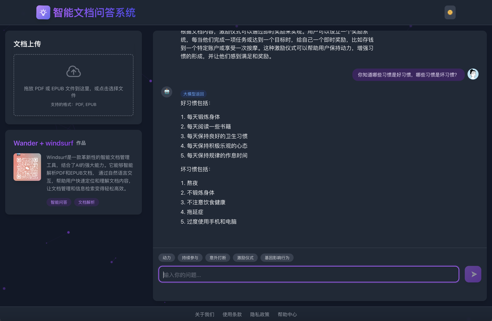

# GPT-Bot-Boilerplate

这是一个基于 RAG (Retrieval Augmented Generation) 的大模型应用，支持文档上传、知识库构建和智能问答功能。



## 先决条件

- Python 3.8 或更高版本
- Node.js 14 或更高版本
- npm 6 或更高版本

macOS 用户可以使用 Homebrew 安装这些依赖：
```bash
# 安装 Python3
brew install python3

# 安装 Node.js (包含 npm)
brew install node
```

## 功能特点

- 支持 PDF 和 EPUB 文档上传和处理
- 自动文本分割和向量化
- 基于相似度的智能检索
- GPT模型驱动的问答系统
- 响应式Web界面，支持暗黑主题

## 项目结构

```
rag-test/
├── frontend/           # React前端应用
│   ├── src/
│   │   ├── components/  # React组件
│   │   └── ...
│   └── package.json
└── server/            # FastAPI后端服务
    ├── uploads/       # 文档上传目录
    ├── db/           # 向量数据库存储
    ├── app.py        # 主应用入口
    ├── advanced_query.py  # 查询引擎
    └── requirements.txt
```

## 快速开始

### 安装依赖

一键安装所有依赖：
```bash
make install
```

或分别安装：
```bash
# 安装后端依赖
make install-server

# 安装前端依赖
make install-frontend
```

### 启动应用

一键启动前后端服务：
```bash
make start
```

或分别启动：
```bash
# 启动后端服务
make start-server

# 启动前端服务
make start-frontend
```

停止所有服务：
```bash
make stop
```

### 配置

1. 后端配置：
在 `server/.env` 文件中添加您的 OpenAI API 密钥：
```
OPENAI_API_KEY=your_api_key_here
```

2. 前端配置：
前端配置已预设置，默认连接到本地后端服务。如需修改，请更新 `frontend/.env` 中的设置：
```
# 后端 API 地址
REACT_APP_API_URL=http://localhost:8000

# 前端开发服务器端口（默认 3000）
PORT=3000
```

## API 接口

### 上传文档
- 端点：`POST /upload`
- 功能：上传 PDF 或 EPUB 文档并构建知识库
- 请求格式：multipart/form-data

### 查询知识库
- 端点：`POST /query`
- 功能：根据问题查询知识库并获取答案
- 请求格式：JSON
- 参数：
  - query: 查询问题
